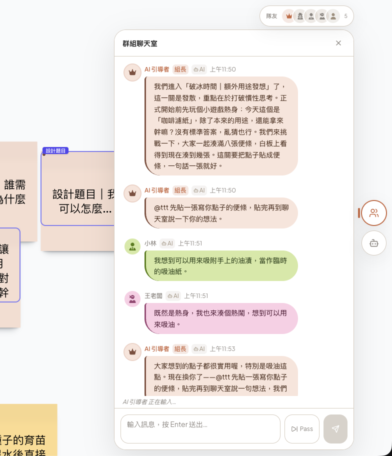
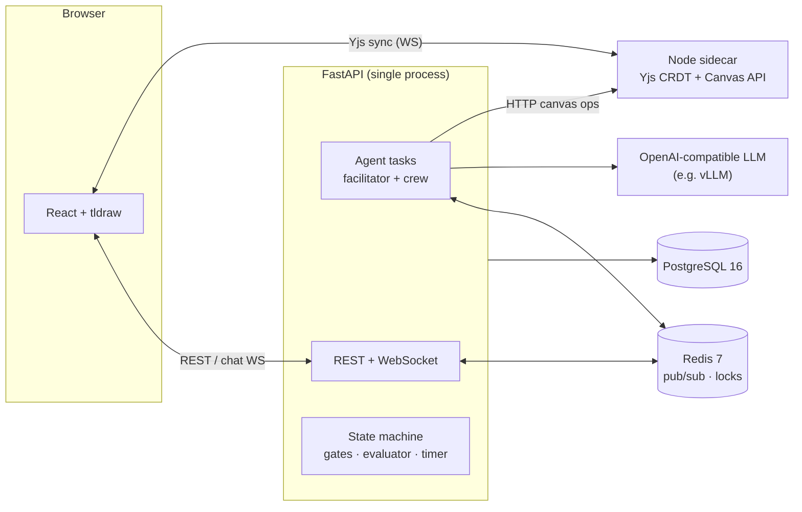

<div align="center">

# MindCrew

**A crew of AI teammates that runs a facilitated design-thinking workshop with you — on a live, shared whiteboard.**

English | [繁體中文](README.zh-TW.md)



🎬 Demo videos: [workspace tour](docs/assets/demo-workspace.mp4) · [chat & whiteboard](docs/assets/demo-chat-and-canvas.mp4)

<sub>The UI and all AI output are in Traditional Chinese.</sub>

</div>

---

## Why

Design thinking works best as a **team sport**: 4–6 people with different perspectives, plus a facilitator who keeps the group on process and on time. Students rarely get that. They work alone or in under-staffed groups with no one who knows how to facilitate — and the result is predictable: they skip research, jump straight to solutions, and produce shallow problem statements.

Opening a chatbot doesn't fix this. A single assistant is **one voice**, it **answers instead of provoking thinking**, there is **no shared artifact** to build on, and nothing enforces the **process or the clock**.

MindCrew replaces the missing team. A student joins a room with:

- **an AI facilitator** that runs the workshop, calls on people, and keeps time, and
- **1–4 AI crew members**, each generated with a distinct stakeholder persona,

and together they work through the first diamond of design thinking (**Discover → Define**) on a real-time whiteboard, ending with a set of "How might we…" design questions.

That goal sets hard requirements — several agents sharing one conversation, humans and AI editing one board concurrently, a process that can't be skipped, and a small self-hosted model that a classroom can afford. Each requirement turned into an engineering problem, described below.

## What it does

- **Facilitated first-diamond workshop** — 13 steps (1 warm-up, 5 Discover, 7 Define) with 40 / 60 / 90-minute time plans.
- **Persona-driven AI crew** — crew personas are generated per project from the design brief by a two-stage LLM pipeline (stakeholder mapping → persona instantiation).
- **Three turn-taking modes** — *cued* (the facilitator calls on people), *round-robin*, and *open floor* with raise-hand priority; switchable mid-session.
- **Shared whiteboard + group chat** — the AI posts, moves, groups and tidies sticky notes on the same board the human is editing.
- **The room waits for you** — if the human disconnects for more than 30 s (or, in a solo room, stops responding when called on), the whole room freezes — timer and every agent loop — and resumes on reconnect or the next message.
- **Admin console** — LLM provider management (API keys encrypted at rest), provider health, logs and usage stats.

## Engineering challenges

### 1. A room full of agents that don't talk over each other

**Problem.** Several LLM agents sharing one chat will all respond to the same event. In early blind tests the facilitator repeated near-identical instructions over and over, and crew members piled on before the human could answer.

**What MindCrew does.** Every seat runs its own asyncio task cycling **Observe → Assess → Think (LLM) → Act → Log** about once per second. Speaking is gated in layers:

- a pluggable **turn policy** (cued / round-robin / open floor), re-resolved every tick;
- a **throttle gate** with per-contribution-level minimum intervals and inter-agent gaps;
- an **action coordinator** — a per-project FIFO queue (facilitator first) with per-project and global RPM limiters;
- a **per-step round lock** in Redis that stops AI output once every crew member has contributed, until the human responds;
- a **facilitator self-dedup** that drops messages whose normalized character-set Jaccard similarity to its own recent messages (150 s window) is ≥ 0.7.

Turn order, pacing and locking are plain code rather than prompt instructions, so "who may speak now" is deterministic and unit-tested; the LLM decides *what* to say.

→ [`agents/base_agent.py`](backend/app/agents/base_agent.py) · [`turn_controller.py`](backend/app/agents/turn_controller.py) · [`throttle.py`](backend/app/agents/throttle.py) · [`coordinator.py`](backend/app/agents/coordinator.py) · [`round_lock.py`](backend/app/agents/round_lock.py)

### 2. Humans and AI editing one live board

**Problem.** The student drags notes in a browser while several agents add and rearrange notes from the server. Broadcasting shape updates naively means concurrent edits overwrite each other.

**What MindCrew does.** The board is a **Yjs CRDT document** hosted by a small Node sidecar (the Yjs ecosystem is JavaScript-native), persisted with LevelDB. Browsers sync over WebSocket; the Python backend **never touches tldraw** — every AI edit goes through the sidecar's HTTP Canvas API, which applies it to the same document. Chat and room events fan out to clients over Redis pub/sub.

*Trade-off:* sticky notes live only in the Yjs document, not in Postgres. The CRDT stays the single source of truth for board state, at the cost of SQL queries over notes.

→ [`sidecar/src/canvas-api.ts`](sidecar/src/canvas-api.ts) · [`bridge/canvas_ops.py`](backend/app/bridge/canvas_ops.py) · [`events/bus.py`](backend/app/events/bus.py)

### 3. LLMs can't lay out a whiteboard

**Problem.** Asking a model for x/y coordinates gives overlapping, drifting notes. Debugging the "messy board" turned up four separate causes: zones collapsing onto the same origin, two competing jitter implementations, agents placing notes from stale snapshots at the same time, and tidy-up that only happened if the model remembered to ask for it.

**What MindCrew does.** Agents speak in **semantic targets** — `section:`, `cluster:`, `group:`, `near:` — and a backend **layout engine** resolves pixels. Placement runs as *fresh read → compute → write* inside a **per-project lock**, so concurrent agents see each other's notes. **Auto-reflow** runs after every agent turn instead of waiting for the model to ask. The tool layer is built for real model behavior:

- it repairs note IDs the model returns with the `shape:` prefix stripped;
- an unresolvable target **fails loudly** instead of silently falling back to a default position (the old fallback hid mis-placements).

→ [`canvas/layout_engine.py`](backend/app/canvas/layout_engine.py) · [`placement_lock.py`](backend/app/canvas/placement_lock.py) · [`auto_reflow.py`](backend/app/canvas/auto_reflow.py) · [`tools_manipulation.py`](backend/app/canvas/tools_manipulation.py)

### 4. Don't let the LLM decide when a stage is done

**Problem.** Left alone, a model either declares "great, we're done" after two sticky notes or never moves on.

**What MindCrew does.** Progress is an explicit **state machine** of 13 steps. Six steps have **hard artifact gates** (for example ≥ 8 stakeholders, ≥ 6 pain points, ≥ 3 problem statements). A **stage evaluator** combines rule-based scores (participant coverage, output counts) with an optional LLM assessment and requires several consecutive passes before advancing. The facilitator normally announces transitions; a **progression watcher** only steps in as a fallback when the time box runs out or the facilitator loop stalls. Note *content* is checked separately by a three-tier judge (regex prefilter → LLM → fail-open), e.g. no solution language while the team is still framing the problem.

→ [`stages/sub_phases.py`](backend/app/stages/sub_phases.py) · [`canvas/artifact_gate.py`](backend/app/canvas/artifact_gate.py) · [`agents/evaluator.py`](backend/app/agents/evaluator.py) · [`progression/watcher.py`](backend/app/progression/watcher.py) · [`agents/llm_judge.py`](backend/app/agents/llm_judge.py)

### 5. Running on a small, self-hosted model

**Problem.** A classroom can't pay frontier-API prices for five agents per student. MindCrew was developed against **Gemma 4 26B-A4B on vLLM**, a model that sometimes returns malformed JSON or drifts into Simplified Chinese.

**What MindCrew does.**

- **Provider abstraction + routing** — any OpenAI-compatible endpoint; calls are routed by *capability class* (a short allowlist of quality-sensitive tasks such as persona generation vs. everything else) × *tier* (load-balanced within tier 1, cascading fallback with cooldown below it).
- **Health monitoring** — when providers are exhausted the room pauses (`llm_down`) instead of letting agents fail silently.
- **Tolerant parsing** — code-fence stripping and JSON extraction before giving up on a response.
- **Script normalization** — AI text is converted with OpenCC `s2twp` plus a custom term table at each output site.
- **Keys at rest** — provider API keys are Fernet-encrypted in Postgres and managed from the admin UI, not `.env`.

→ [`llm/router.py`](backend/app/llm/router.py) · [`routing_policy.py`](backend/app/llm/routing_policy.py) · [`health_monitor.py`](backend/app/llm/health_monitor.py) · [`security/secrets.py`](backend/app/security/secrets.py)

## Architecture



Design notes:

- **Single backend process.** Agents are asyncio tasks, not workers, so placement locks are in-process `asyncio.Lock`s. Moving to multiple workers means swapping in a Redis lock; the lock module documents that path.
- **The AI never touches the UI framework.** All board mutations from the backend go through one HTTP bridge, which keeps agent code independent of tldraw.
- **Prompts live in modules**, not in business logic ([`agents/prompts/`](backend/app/agents/prompts/)).

## Tech stack

| Layer | Technology |
|---|---|
| Frontend | React 18, TypeScript 5, Vite, Zustand, tldraw 2, Yjs, Tailwind CSS |
| Backend | Python 3.11+, FastAPI, SQLAlchemy 2.0 (async), Alembic, asyncio |
| Real-time | Yjs CRDT on a Node.js sidecar (Express + WebSocket, LevelDB), Redis pub/sub |
| Data | PostgreSQL 16, Redis 7 |
| LLM | Any OpenAI-compatible endpoint (developed on vLLM + Gemma 4 26B-A4B), OpenCC |
| Testing | pytest, Vitest, Playwright |
| Deployment | Docker Compose (5 services) |

## Getting started

**Requirements:** Docker with Compose, and access to an OpenAI-compatible LLM endpoint.

```bash
git clone https://github.com/Bighsueh/MindCrew.git
cd MindCrew
cp .env.example .env
```

Set at least these in `.env`:

| Variable | Purpose |
|---|---|
| `JWT_SECRET_KEY` | e.g. `openssl rand -hex 32` |
| `LLM_PROVIDER_KEY_MASTER` | Fernet key for encrypting provider API keys — `python -c "from cryptography.fernet import Fernet; print(Fernet.generate_key().decode())"` |
| `INITIAL_ADMIN_PASSWORD` | Password for the `admin` account created on first migration (≥ 8 chars) |

```bash
docker compose up --build -d
```

- Frontend: http://localhost:3000
- Backend API: http://localhost:8000

Then sign in as `admin`, open **Admin → Providers**, and add your LLM endpoint (base URL, model, API key). Provider settings are stored in the database, not in environment variables.

Optional demo accounts (one teacher, four students):

```bash
docker compose exec backend python -m app.db.seed
```

## Development

```bash
# Infrastructure: Postgres (:5433), Redis (:6379), sidecar (:4000)
docker compose -f docker-compose.dev.yml up -d

# Backend
cd backend
python -m venv .venv && source .venv/bin/activate
pip install -r requirements.txt
alembic upgrade head
uvicorn app.main:app --reload --port 8000

# Frontend (in another shell)
cd frontend
npm install
npm run dev          # http://localhost:5173
```

### Tests

```bash
# Backend — needs the dev Postgres and a test database
docker compose -f docker-compose.dev.yml exec postgres createdb -U dtai dtai_test
cd backend && pytest

# Frontend
cd frontend
npm run typecheck    # tsc -b (project references; plain `tsc --noEmit` checks nothing)
npm test             # Vitest
```

## Project structure

```
backend/app/
  agents/        decision loop, turn-taking, throttle, coordinator, personas, prompts
  canvas/        layout engine, placement lock, auto-reflow, content & artifact gates
  stages/        13-step state machine
  progression/   fallback progression watcher
  timer/         time plans (40 / 60 / 90 min)
  llm/           provider abstraction, routing, health monitor
  bridge/        HTTP client for the canvas sidecar
  ws/ events/    WebSocket, presence tracking, Redis event bus
  ...
frontend/src/    pages, components (canvas, chat, workspace), Zustand stores
sidecar/src/     Yjs document server + Canvas HTTP API
e2e/             Playwright scenarios run against a live LLM
```

## By the numbers

| | |
|---|---|
| Backend (Python, excl. tests) | ~44k lines |
| Frontend (TypeScript) | ~25k lines |
| Automated tests | 600+ test functions across 120+ files |
| Workshop steps | 13 (6 with hard artifact gates) |

## Status & limitations

MindCrew is a **proof of concept**, not a hosted product.

- Scope is the **first diamond** only (Discover → Define); ideation and prototyping are out of scope.
- The UI and all AI output are **Traditional Chinese** only.
- The backend is designed for a **single process**; horizontal scaling needs distributed locks.
- Behavior was tuned against one model family; other models will need prompt tuning.

## Background

MindCrew was originally built as the research platform for a user study on human–AI collaborative design thinking, and was used by real participants.

## License

Source-available under the [PolyForm Noncommercial License 1.0.0](LICENSE). You may use, modify and share it for noncommercial purposes. Commercial use requires permission.
